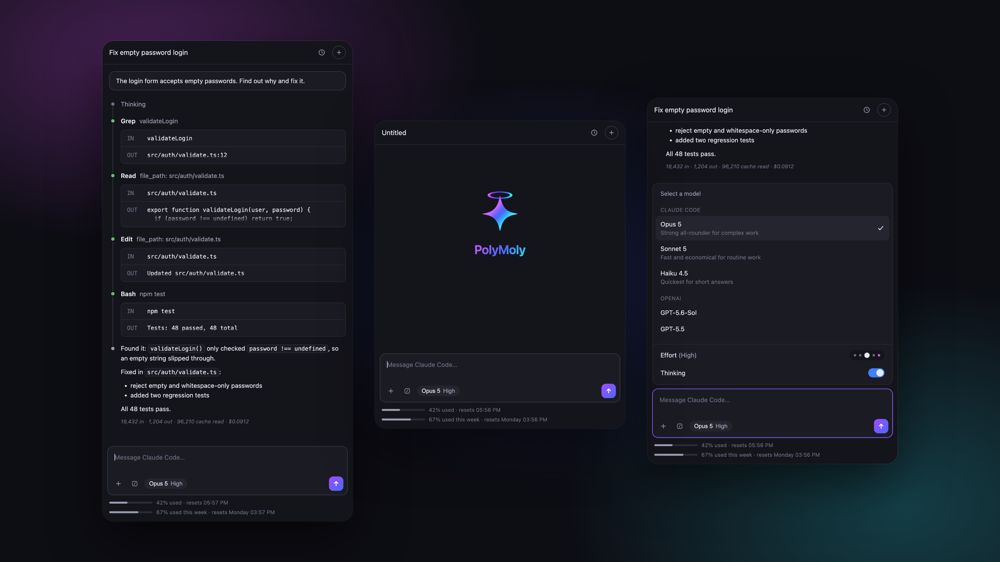
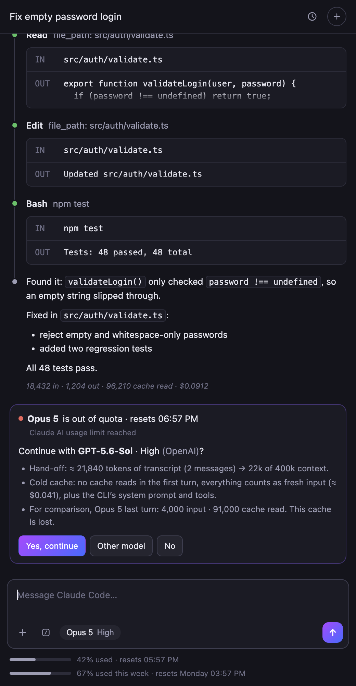
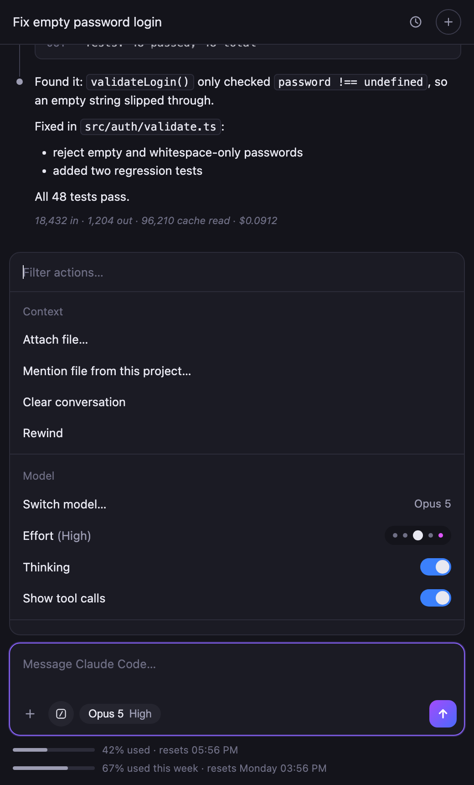
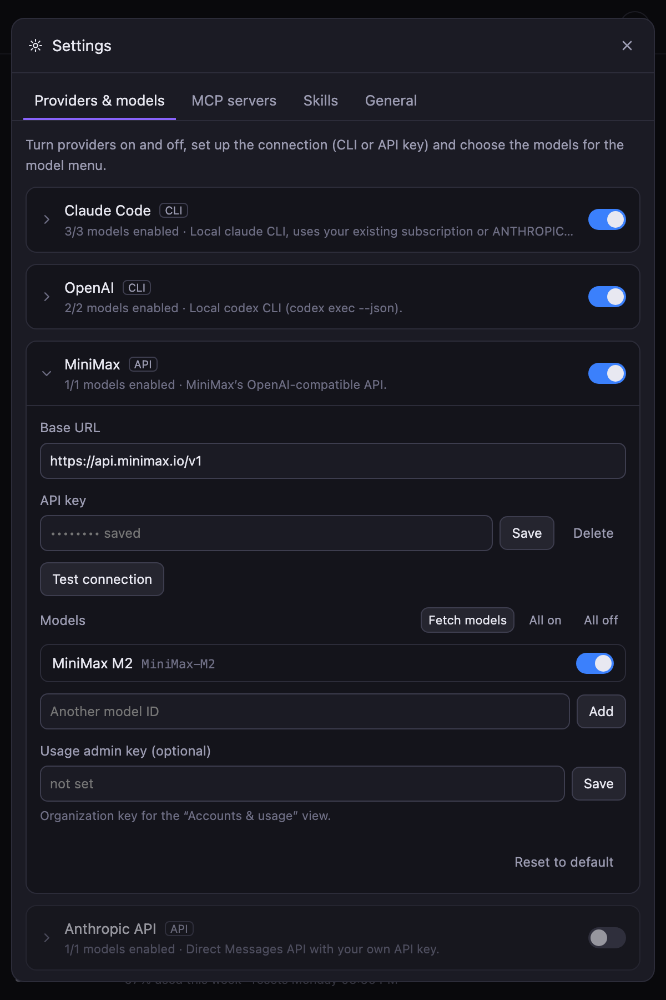
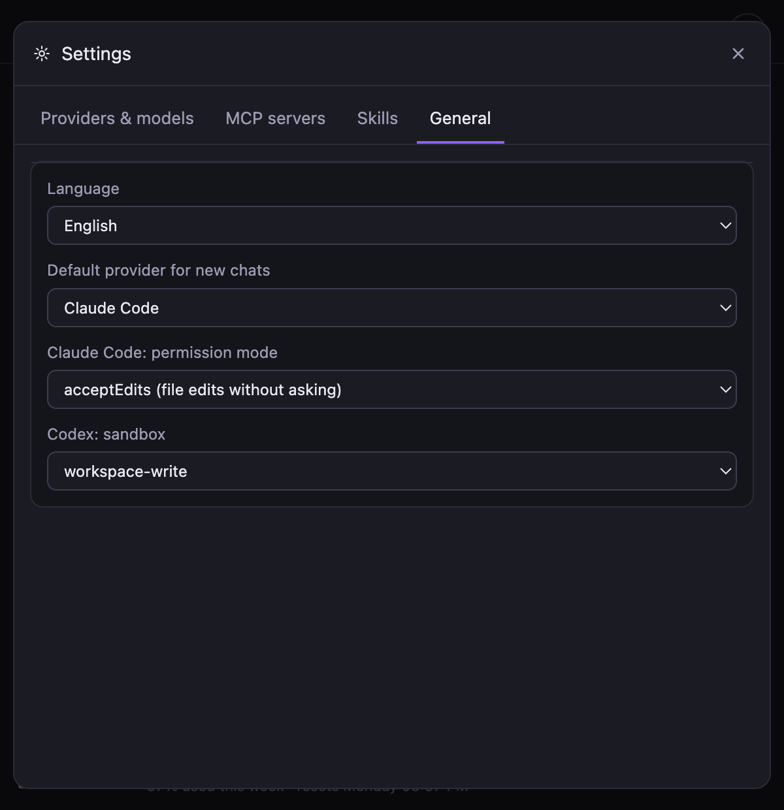
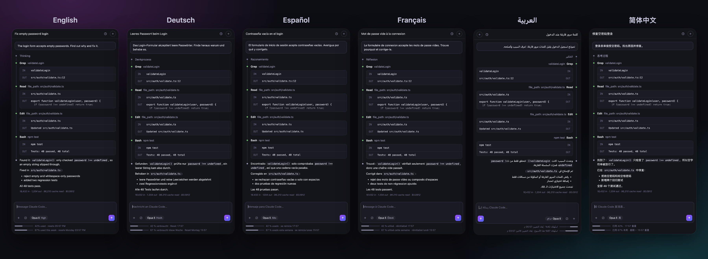
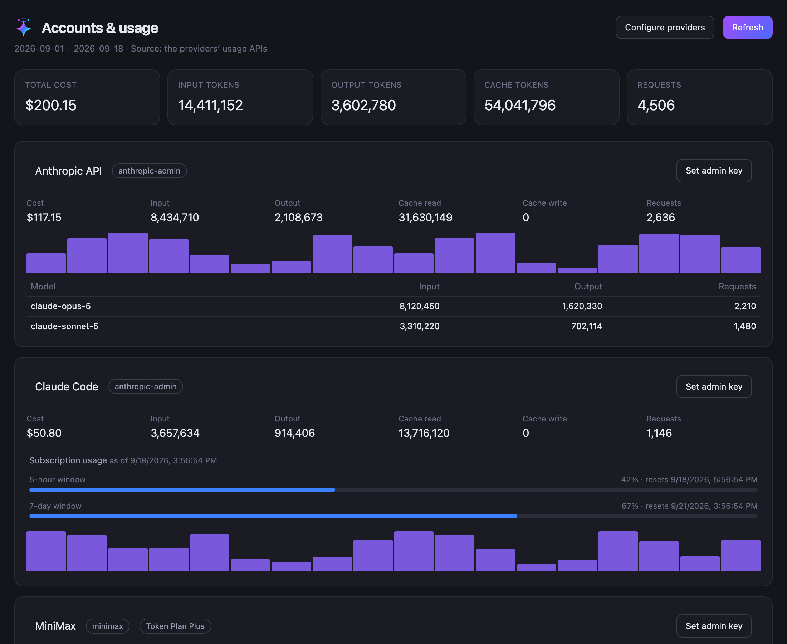

<div align="center">


# PolyMoly

**One chat panel for all your coding agents.**
Claude Code, Codex, MiniMax and any OpenAI- or Anthropic-compatible API, side by side in VS Code.
Switch models mid-conversation, keep one skill library for every agent, and see what every account costs in one place.

[](https://code.visualstudio.com/)
[](https://github.com/sayedmahmod/polymoly/releases)
[](LICENSE)
[](tsconfig.json)
[](#languages)

`claude-code` · `codex` · `minimax` · `mcp` · `agent-skills` · `multi-provider` · `llm` · `vscode-extension`

<br />



</div>

---

## Contents

- [Why PolyMoly](#why-polymoly)
- [Installation](#installation)
- [First steps](#first-steps)
- [Features](#features)
- [Languages](#languages)
- [Providers](#providers)
- [Accounts & usage](#accounts--usage)
- [Settings](#settings)
- [Development](#development)

## Why PolyMoly

Every coding agent ships its own UI, its own history and its own limits. When one runs out of quota in the middle of a task, you start over somewhere else. PolyMoly puts them behind one interface:

- **One chat, many agents.** The local `claude` and `codex` CLIs and any HTTP API share the same transcript, tool timeline and composer.
- **Hand-off instead of dead ends.** When a provider hits its limit, PolyMoly proposes an equivalent model at another provider and passes the conversation over.
- **Shared MCP servers and skills.** Configure them once, every agent gets them.
- **One view for spend.** Tokens, cost and subscription windows of every account on a single page.

## Installation

### Option A: download the release (recommended)

1. Download `polymoly-<version>.vsix` from the [latest release](https://github.com/sayedmahmod/polymoly/releases/latest).
2. Install it in one of two ways:
   - **In VS Code:** open the Extensions view (`⇧⌘X` / `Ctrl+Shift+X`), click the `···` menu in its title bar, choose **Install from VSIX…** and pick the file.
   - **From a terminal:**
     ```bash
     code --install-extension polymoly-0.1.0.vsix
     ```
3. Run **Developer: Reload Window**. The PolyMoly icon appears in the activity bar.

The same `.vsix` works in Cursor, Windsurf and VSCodium (`cursor --install-extension …`, and so on).

### Option B: build from source

Requires Node.js 20 or newer.

```bash
git clone https://github.com/sayedmahmod/polymoly.git
cd polymoly
npm install
npx @vscode/vsce package -o polymoly.vsix
code --install-extension polymoly.vsix
```

### Agent CLIs (optional)

PolyMoly drives the agents you already have. Install the ones you want and log in once in a terminal:

| Agent | Install | Log in |
| --- | --- | --- |
| Claude Code | `npm i -g @anthropic-ai/claude-code` | `claude` |
| Codex | `npm i -g @openai/codex` | `codex login` |

HTTP providers such as MiniMax or the Anthropic API only need an API key (see below). No CLI needed.

## First steps

1. Open **PolyMoly** in the activity bar.
2. Click the model chip in the composer and pick a model.
3. For HTTP providers, add a key: action menu (`/`) → **Providers & models** → expand the provider → **API key** → **Save**. Keys are stored in VS Code's SecretStorage, never in `settings.json`.
4. Type your task and press `Enter`. `Shift+Enter` inserts a new line.

## Features

### Transcript with tool timeline

Thinking, every tool call (with input and output) and the final answer appear as one timeline. Click a tool call to expand its full output. Each answer shows its token usage and cost; bars under the composer show the current session and weekly limits.

### Switch models mid-chat

Change the model at any time. A CLI agent that missed part of the conversation receives a compact transcript before the next prompt: tool calls are summarised, long outputs trimmed, and the oldest messages dropped if the transcript would take more than half of the target's context window. Each chat remembers the session ID per provider, so follow-up turns resume with `claude --resume` or `codex exec resume` instead of starting over.

### Hand-off when a provider runs dry



When a provider reports an exhausted limit (usage limit, rate limit, quota, empty balance), PolyMoly shows a card that proposes a model of the same class at another provider, with the same effort level.

The card is transparent about the cost of switching: approximate hand-off size in tokens, the target's context window, and the fact that the new provider starts with a cold cache. **Yes, continue** switches and lets the new model finish the interrupted task.

Providers without a key, or that are out of quota themselves, are never proposed. Model classes come from `tier` (`fast`, `balanced`, `flagship`, `frontier`); set a fixed order with `polyagent.fallbackOrder`.

<br clear="right" />

### Attachments

Drag files into the chat (hold `Shift` while dropping, a VS Code rule for webviews), paste screenshots with `⌘V`, or use **+**. Each file chip tells you how the current model will receive it:

- **normal**: the model reads the file directly
- **yellow**: the agent only gets the path and opens the file itself
- **red**: the model cannot take this file, so it is not sent

### Action menu



Press `/` in an empty composer, or click the `/` button. From here you attach or mention files, clear or rewind the conversation, switch model, set effort and thinking, toggle tool calls, and open MCP servers, skills, provider settings, usage and the provider status check.

Installed skills appear at the bottom; picking one inserts `/skill-name` into the composer.

<br clear="right" />

### MCP servers

Add stdio, HTTP or SSE servers once under **Settings → MCP servers**. Claude Code receives them via `--mcp-config`, Codex via `-c mcp_servers.*`.

### Skills

Skills in the `SKILL.md` format live in one shared folder (`~/.polyagent/skills` by default) and work with every provider. Install from:

- a GitHub link to a repo or subfolder, for example `https://github.com/anthropics/skills/tree/main/skills/pdf`
- any Git URL, or a URL to a `SKILL.md` or ZIP archive
- a local folder, `SKILL.md`, `.zip` or `.skill` file

Skills already in `~/.claude/skills`, `~/.codex/skills` or `~/.agents/skills` can be imported with one click. Claude Code and Codex get the list of active skills and read one when it fits. Starting a message with `/name` loads the whole skill into the prompt, for any provider.

### Settings in the panel

<p align="center">
  
  &nbsp;
  
</p>

Turn providers and single models on and off, test connections, fetch the model list of an API, add custom providers and set keys, all without editing JSON.

## Languages

The whole interface is available in **German, English, Spanish, French, Arabic** (right-to-left) and **Simplified Chinese**. Pick one under **Settings → General → Language**, or set `polyagent.language`. `auto` follows the VS Code display language. Command titles and setting descriptions follow the VS Code display language.



## Providers

| ID | Type | Connection |
| --- | --- | --- |
| `claude` | CLI | `claude -p --output-format stream-json` |
| `codex` | CLI | `codex exec --json` |
| `minimax` | HTTP | `https://api.minimax.io/v1`, OpenAI-compatible |
| `anthropic-api` | HTTP | `https://api.anthropic.com/v1`, Messages API |

### Custom providers

Add providers in the settings panel, or in `settings.json` under `polyagent.providers`. An entry with an existing `id` overrides the built-in one field by field; any other `id` creates a new provider.

```jsonc
"polyagent.providers": [
  {
    "id": "groq",
    "label": "Groq",
    "kind": "http",
    "api": "openai",
    "baseUrl": "https://api.groq.com/openai/v1",
    "defaultModel": "llama-3.3-70b-versatile",
    "models": [
      { "id": "llama-3.3-70b-versatile", "label": "Llama 3.3 70B",
        "pricing": { "input": 0.59, "output": 0.79 } }
    ],
    "usage": { "kind": "none" }
  },
  {
    "id": "my-agent",
    "label": "My agent",
    "kind": "cli",
    "command": "/usr/local/bin/my-agent",
    "protocol": "claude-stream-json",
    "extraArgs": ["--no-color"]
  }
]
```

| Kind | Fields |
| --- | --- |
| `cli` | `command`, `protocol` (`claude-stream-json` or `codex-jsonl`), `extraArgs`, `env` |
| `http` | `baseUrl`, `api` (`openai` or `anthropic`), `headers`, `maxTokens`, `systemPrompt` |
| both | `models`, `defaultModel`, `supportsEffort`, `supportsThinking`, `usage` |

Per model: `label`, `description`, `tier`, `efforts`, `defaultEffort`, `contextWindow`, `inputs` (e.g. `["image", "pdf"]`) and `pricing` (USD per million tokens).

## Accounts & usage



Open it with **PolyMoly: Accounts & usage** or from the action menu. Each provider card queries that provider's own usage API with an admin key, set via **PolyMoly: Set usage admin key for provider**.

| Source | Endpoint |
| --- | --- |
| `anthropic-admin` | `/v1/organizations/usage_report/messages` and `/cost_report` (admin key) |
| `openai-admin` | `/v1/organization/usage/completions` and `/v1/organization/costs` (admin key) |
| `minimax-token-plan` | `/v1/token_plan/remains` (Token Plan key `sk-cp-…`) |
| `custom-http` | any request, mapped into the report with dot paths |

```jsonc
"usage": {
  "kind": "custom-http",
  "url": "https://api.example.com/v1/usage?from={{start}}&to={{end}}",
  "headers": { "authorization": "Bearer {{key}}" },
  "map": {
    "inputTokens": "data.total.input_tokens",
    "outputTokens": "data.total.output_tokens",
    "costUsd": "data.total.cost_usd",
    "balanceUsd": "data.balance"
  }
}
```

Placeholders: `{{start}}`, `{{end}}` (ISO 8601), `{{startUnix}}`, `{{endUnix}}` and `{{key}}`.

> [!NOTE]
> Billing APIs only report API traffic. Usage through a Claude or ChatGPT subscription does not show up there. For Claude Code, PolyMoly also records the `rate_limit_event` messages of the CLI and shows the 5-hour and 7-day windows from the last chat turn.

## Settings

| Key | Default | Effect |
| --- | --- | --- |
| `polyagent.language` | `auto` | UI language: `auto`, `de`, `en`, `es`, `fr`, `ar`, `zh` |
| `polyagent.defaultProvider` | `claude` | Provider preselected in new chats |
| `polyagent.providers` | `[]` | Custom providers and overrides |
| `polyagent.mcpServers` | `{}` | MCP servers shared by all CLI providers |
| `polyagent.skills.directory` | `""` | Skills folder, empty means `~/.polyagent/skills` |
| `polyagent.skills.disabled` | `[]` | Skills that are switched off |
| `polyagent.fallbackOrder` | `[]` | Hand-off targets, `provider` or `provider/model` |
| `polyagent.claude.permissionMode` | `acceptEdits` | `--permission-mode` of the Claude CLI |
| `polyagent.codex.sandbox` | `workspace-write` | `--sandbox` of `codex exec` |
| `polyagent.usage.days` | `30` | Days queried by the usage view |
| `polyagent.usage.autoRefreshMinutes` | `0` | Auto-refresh of the usage view, `0` is off |

> [!IMPORTANT]
> `acceptEdits` lets the Claude CLI edit files in your workspace without asking, because nobody can confirm prompts in headless mode. Use `plan` for read-and-plan only. `bypassPermissions` also runs shell commands without asking, so only use it in a sandbox.

## Development

```bash
npm install
npm run watch        # rebuilds dist/ on change
```

Press `F5` in VS Code to start an Extension Development Host with PolyMoly loaded.

```
src/extension.ts            activation, commands, key management
src/i18n.ts                 all UI strings in six languages
src/providers/              registry, CLI adapter, HTTP adapter
src/chat/                   conversation store, turn controller, hand-off planning
src/skills/skills.ts        skill store, installation, delivery to providers
src/usage/                  usage reports and live limits per provider
src/views/                  chat view and usage panel (webviews)
media/                      webview UI: chat.css/js, usage.css/js, logo
```

Every adapter emits the same event stream (`text_delta`, `thinking_delta`, `tool_start`, `tool_end`, `usage`, `rate_limit`, `error`, `done`), so a new provider only has to produce that stream; the UI stays unchanged.

### Adding a language

Add a column to the rows in [`src/i18n.ts`](src/i18n.ts), add the code to `LANGS`, `LOCALES` and `LANGUAGE_NAMES`, and create a `package.nls.<code>.json` for command and setting titles.

## License

[MIT](LICENSE)

<sub>PolyMoly is an independent project and is not affiliated with Anthropic, OpenAI or MiniMax. Product names belong to their owners.</sub>
